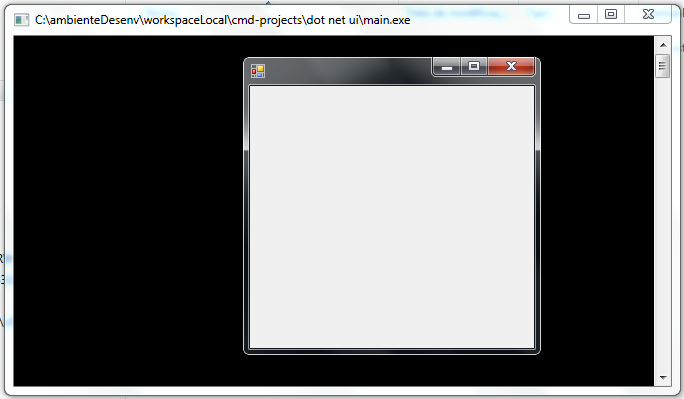

# Testando JScript.NET

JScript é a linguagem similar ao JavaScript, desenvolvida pela microsoft para ter uma linguagem de script equivalente a de mercado na época, rodando no Internet Explorer (seria a mesma relação do Super Homem e do Bizarro).

O JScript foi a linguagem oficial do navegador até sua versão 9 ou 10, entre as suas mais conhecidas caracteristicas está o objeto ActiveX, que permitia numa época remota a importação de diversas bibliotecas microsoft de dentro do sistema operacional, entre elas a mais conhecida é a biblioteca do Outlook de transferência de XML via HTTP para ser usada no browser, que se tornou, eventualmente, o modelo padrão requisições HTTP assíncronas para o JavaScript (XMLHttpRequest).

O JScript foi desenvolvido em 1996 e ganhou sua versão .NET em 2005, morrendo pouco tempo depois. Apesar do JScript.NET ser descontinuado pela microsoft, o compilador ```jsc.exe``` tem sempre vindo nas novas versões do Visual Studio.

Neste exemplo eu faço a instância de de um componente do .NET Framework utilizando JScript. 



Assim como qualquer linguagem .NET você pode gerar com isso um .exe ou um .dll. 